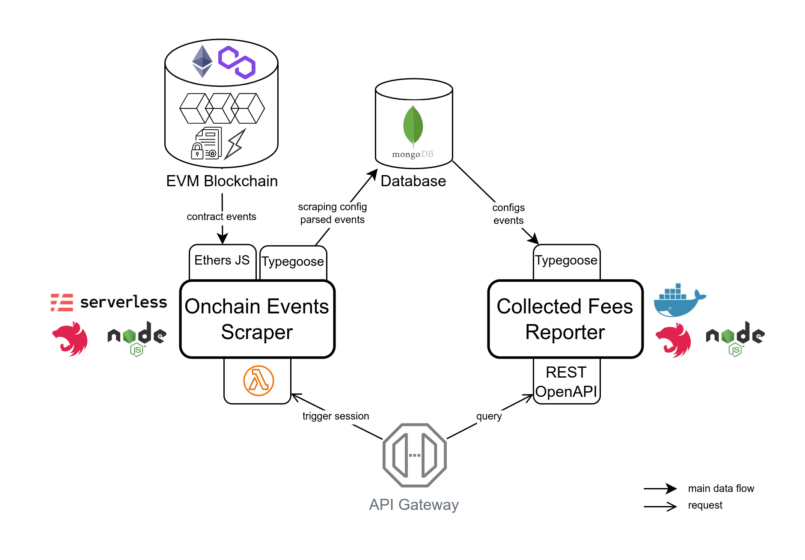

# LiFi FeeCollector Events Reporter

## Overview

### Purpose

This is a mono-repository for developing and running 2 main backend services, on top of the [LiFi protocol](https://li.fi):

1. A serverless scraper of on-chain events: `FeeCollected` events emitted by the LiFi `FeeCollector` contracts deployed on several blockchains. A scraping session can be triggered manually or scheduled to run periodically on a given blockchain.

2. A backend REST/json API to report the fees collected by the integrators of the LiFi protocol

A database stores and indexes the collected onchain events, as well as the supported chains' configuration. The scraper feeds the DB while the reporter consumes its data, towards clients.

### Technical Stack



The `FeeCollected` events are stored in a [MongoDB](https://mongodb.com/) database/cluster. [Typegoose](https://typegoose.github.io/typegoose/) is used, on top of the [Mongoose](https://mongoosejs.com/) ODM, as well as the [GrapeoffJS/kindagoose](https://github.com/GrapeoffJS/kindagoose) for the NestJS integration.

The [NestJS](https://github.com/nestjs/nest) development framework is used as one of the main foundation for developing the backend modules.

The [Serverless](https://serverless.com/) framework/tooling is used for developing locally the events scraper and deploying the functions on AWS Lambda for instance.

[Docker](https://docker.com) containers are used for packaging and for easily managing the composition of servers to run locally.

## Installation

[Node.js](https://nodejs.org/) must be installed on your OS. Lower versions than `18.x` have not been tested. The usage of [NVM](https://github.com/nvm-sh/nvm) is recommended to install and manage your Node.js environments.

[pnpm](https://pnpm.io/) is used as the package manager for this project, as well as for managing this mono-repository workspaces. Please refer to its [installation](https://pnpm.io/installation) instructions.

To install all the necessary packages and tooling dependencies, run:

```bash
pnpm project:init
```

Which is equivalent to the following individual commands:

```bash
# Init the Git submodule(s), e.g. LiFi contract types
$ git submodule init

# Download/install all package dependencies
$ pnpm install

# Build / tsc compilation to sub dirs `dist`
$ pnpm -r build
```

## Running the Apps Locally

### Start MongoDB via Docker Compose

Run locally only the Mongo Database:

```bash
docker compose up fcrs-db
```

Run locally the CollectedFees Reporter API, a Mongo DB and a Redis cache server:

```bash
docker compose up
```

Note that the events scraper remains to be manually started.

### Start an Events Scraping session

#### As a Nodejs-based CLI command

The blocks of the specified target blockchain are scanned and the found `FeeCollector.FeeCollected` events are imported into MongoDB.

```bash
cd ./events-scraper && pnpm start
```

The default target blockchain is then 'Polygon mainnet' (key: `pol`), and the target LiFi FeeCollector contract is [`0xbD6C7B0d2f68c2b7805d88388319cfB6EcB50eA9`](https://polygonscan.com/address/0xbD6C7B0d2f68c2b7805d88388319cfB6EcB50eA9#events).

Refer to [events-scraper main](./events-scraper/src/main.ts) and the chains' configuration in [fee-collector.config](./common/src/config/fee-collector.config.ts) to change the default config.

#### Using the Serverless Offline Framework

You can use the local Serverless offline runtime framework, run:

```bash
# Start all available serverless functions
$ pnpm serverless:offline

# From the sub-project
$ cd ./events-scraper && pnpm serverless offline
```

Then you trigger the scraping function using a GET request [`http://localhost:3003/dev/collectedfees/scrap/{chainKey}`](http://localhost:3003/dev/collectedfees/scrap/pol)

### Start the Collected Fees Reporter API

For locally running the service, run:

```bash
cd ./fees-reporter && pnpm start
```

You can then request for a report on fees collected by a given integrator, e.g. [`http://localhost:3000/api/v1/collectedfees/integrators/0xD5e230cEa6dA2F0C62bdeED2Cf85326F1063e27D`](http://localhost:3000/api/v1/collectedfees/integrators/0xD5e230cEa6dA2F0C62bdeED2Cf85326F1063e27D)

A sample response (JSON) to a request for the collected fees by an integrator is available [here](./doc/samples/GET-CollectedFeesByIntegrator_sample-RESP_v1.jsonc).

An optional Swagger/OpenAPIv3 documentation of the REST API is published when having the env variable `OPENAPI_PUBLISH` set to `true`:

- Web UI: [/api](http://localhost:3000/api/)
- json: [/api-json](http://localhost:3000/api-json)

A screenshot of the Web view is available [here](./doc/assets/FeeCollectorReporterAPI_SwaggerDoc-screenshot.png).

## Test

_Actual testing framework is not much developped yet._

```bash
# unit tests
$ pnpm run test

# e2e tests
$ pnpm run test:e2e

# test coverage
$ pnpm run test:cov
```

## License

This project is licensed under the [GNU AGPL-v3](LICENSE).
